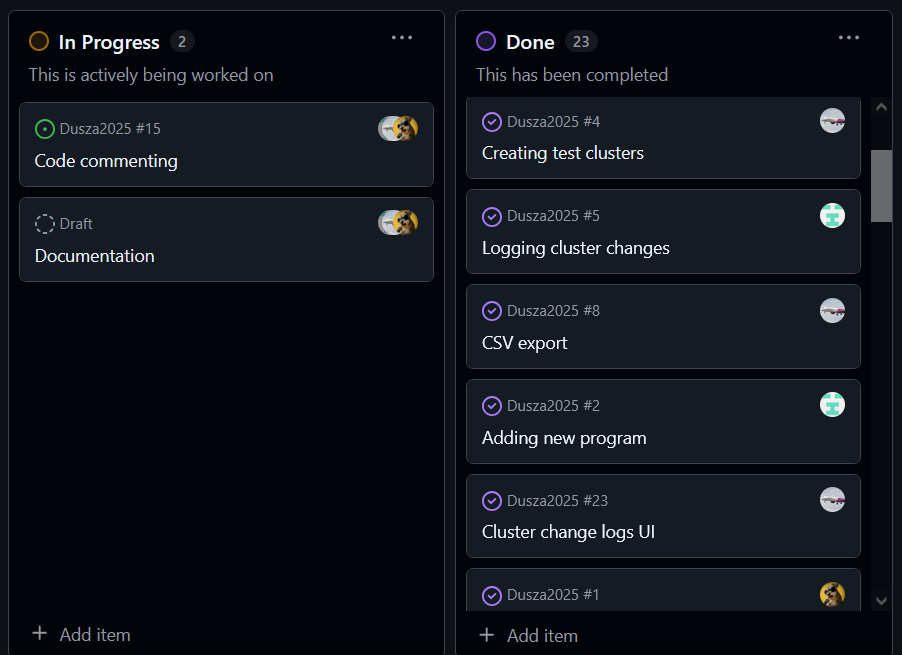

# Fejlesztés menete

## Verziókezelés

A verziókezeléshez Git-et használunk. A Github repónkban több branch-et hoztunk létre. Minden nagyobb funkció fejlesztése egy külön ágon történt. A funkció elkészülése után egy pull request használatával átkerül a kód a `main` branch-be.

Ez a folyamat biztosítja, hogy a `main` branch mindig egy futtatható, súlyos hiba nélküli verziót tartalmaz. A pull request-ek
használata lehetőséget ad ellenőrizni egymás munkáját, és konfliktus esetén megkönnyíti a hiba elhárítását.

## Feladatok követése

A hátralévő feladatok nyílvántartásához, valamint egymás közötti felosztásához a Github Projects szolgáltatást használtuk. Ez a Githubon elérhető funckió automatikusan hozzákapcsolja a feladatokat a repóban található issue-khoz, és különböző formákban,
mint például listaként, vagy kanban táblákként jeleníti meg őket.

## Kommunikáció

A munka közbeni kommunikáció személyesen, valamint Discord-on keresztül történt. Rendszeresen tartottunk hanghívásos megbeszéléseket,
ahol átnéztük a projekt aktuális állapotát, egyeztettük a további feladatokat, és döntést hoztunk a felmerülő kérdésekben.
Ezen kívül folyamatosan elérhetőek voltunk megválaszolni egymás kérdéseit.
