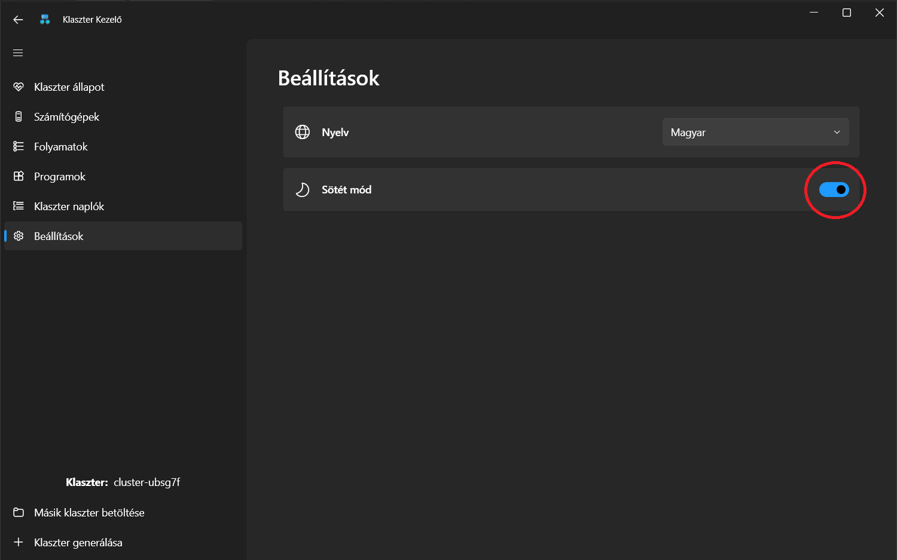
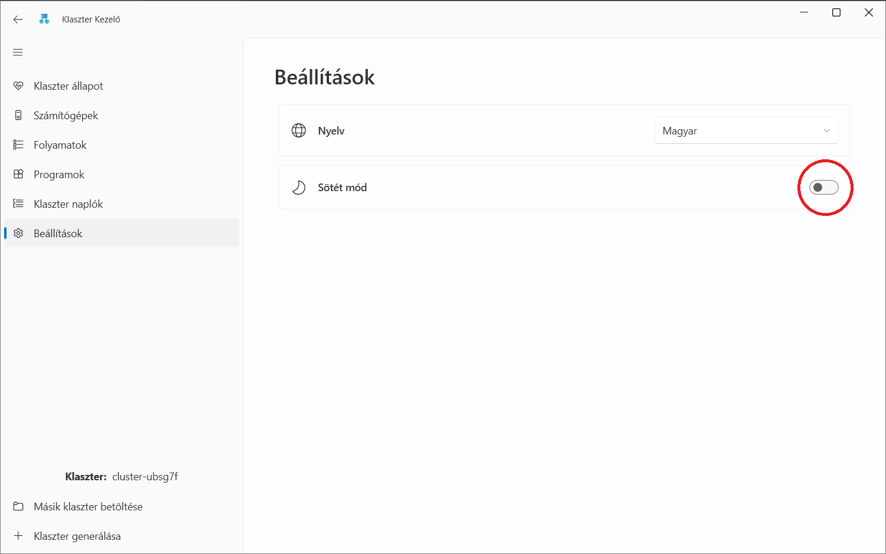
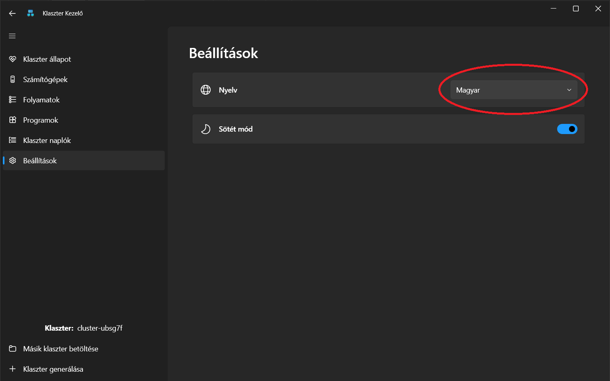
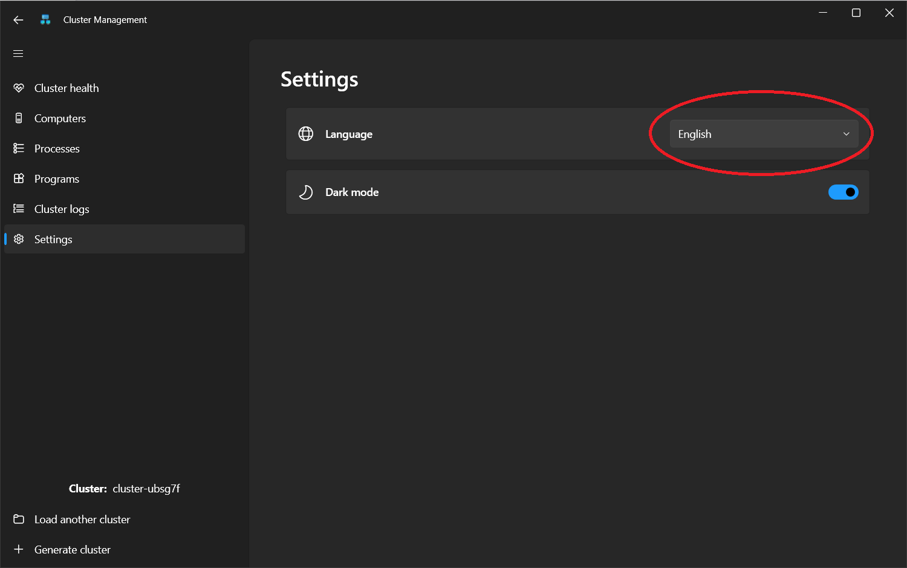

# Beállítások

A Beállítások oldal lehetőséget biztosít az oldal két alapvető tulajdonságának módosítására: a nyelv és a téma beállítására.

## Világos - Sötét mód

Az alkalmazás alapértelmezett megjelenítési témája a sötét mód. Ezen kívűl lehetőség van a világos és sötét módok kiválasztása között. A kiválasztott mód alapján fognak az alkalmazások színei megváltozni.

 

 

## Nyelvválasztás

Az alkalmazás alapértelmezett nyelve magyar. Ezen kívül lehetőség van az alkalmazás angol nyelvű használatára is.

 

 