# Folyamat

A futó programok egy-egy példányát egy-egy folyamat jelenti. A klaszteren lévő folyamatokat fájlokként tároljuk, melyek különböző mappákban találhatók. Például:

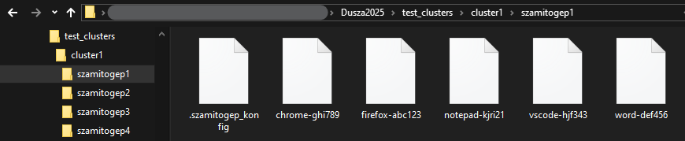

Ezek a fájlok a folyamatok futásának helyét mutatják, azaz azt, hogy mely gépeken zajlanak. Fontos, hogy egy adott program több példányban is futtatható egy [számítógépen](szamitogep.md) (mappában) a klaszteren belül.  
A fájlok neve a következő formátumban jelenik meg: `<programnev> - <random 6 karakter>`, és minden névnek egyedinek kell lennie a klaszteren. Az egyes fájlok tartalmazzák a folyamat aktuális adatait, például:

```
2024-10-27 07:15:45
AKTÍV
100
100
```

Az első sor a folyamat indításának pontos időpontját jelzi, `yyyy.mm.dd hh:mm:ss` formátumban.

## Részletek

A `Folyamatok` fülre kattintva megtekinthetjük a programpéldányokat a betöltött klaszteren. Itt egy dupla oszlopdiagram szemlélteti, hogy az `AKTÍV` és `INAKTÍV` folyamatok száma hogyan oszlik meg, így könnyen áttekinthető, hogy a klaszteren belül hogy alakul programok állapotának megoszlása. Ezen kívül egy kördiagram ábrázolja, hogy melyik [számítógépen](szamitogep.md) **hány folyamat fut**, segítve a rendszer terheltségének vizualizálását.  
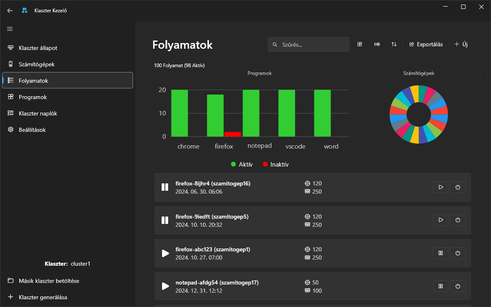  
A grafikonok alatt kártyák jelennek meg, amelyek a különböző folyamatokat mutatják, **részletes információkkal**. A jobb felső sarokban található [szűrőeszközök](#szures-es-rendezes) lehetővé teszik a gyors keresést, míg az [új folyamat](#uj-futtatasa) futtatása gomb segít egy új folyamat elindításában a klaszteren.

## Erőforrásigény

A folyamatok erőforrásigényei, mint például a processzor- és memóriahasználat, alapvetően meghatározzák a rendszer működésének hatékonyságát. Mivel a klaszteren több gép is dolgozik, minden egyes futó folyamat egyedi fájlban tárolja az általa használt erőforrások adatait. A fájlokban található információk közül az **3. és 4. sor** adja meg az adott folyamat, processzor és memória szükségletét.

```
2024-10-27 07:15:45
AKTÍV
100
100
```

Jelen esetben 100 millimag processzorra és 100 MB memória erőforrásra van szükége.

## Állapot

Minden egyes folyamat egy fájlban, a **2. sorban** tárolja az aktuális állapotát, amely lehet `AKTÍV` vagy `INAKTÍV`. Az `AKTÍV` állapot azt jelzi, hogy a folyamat aktívan fut és végrehajtja a feladatát, míg az `INAKTÍV` állapot azt mutatja, hogy a folyamat valamilyen okból nem működik, nem hajt végre műveleteket, vagy leállt. Utóbbi esetben az adott folyamat **nem vesz el erőforrást** a gazdagéptől.

```
2024-10-27 07:15:45
AKTÍV
100
100
```

Jelen esetben a folyamat éppen `AKTÍV`, erőforrást emészt fel.

Az állapot **folyamatonként állítható**, ezt a folyamat mellett lévő `[Play]/[Pause]` gombbal tehetjük meg.  
  
Egy folyamatot azonban csak akkor aktiválható, ha a gazdagépen van elég erőforrás annak aktiválására, egyébként hibát dob.  
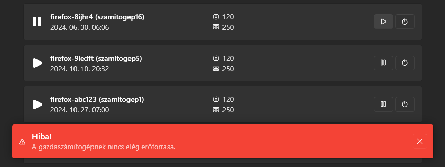

## Szűrés és rendezés

A folyamatok kilistázásakor lehetőség van különböző szűrők és rendezésfajták alkalmazására, amelyek segítenek a keresett információk gyorsabb megtalálásában.

### Szűrés

A szűrés végezhető **[programtípusok](program.md) szerint**, lehetővé téve, hogy csak a kívánt típusú alkalmazások jelenjenek meg. Ezen kívül az **[állapot](#allapot) szerinti** szűrés is elérhető, így könnyen megtalálhatók az aktív vagy inaktív folyamatok. Egy szövegmező segítségével **név alapján** is szűrhetjük a listát, így gyorsan rátalálhatunk egy adott folyamatra.  
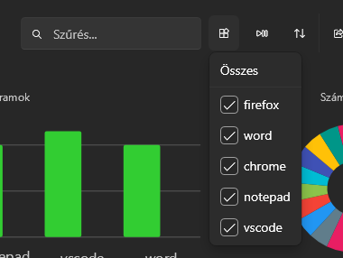
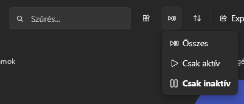

### Rendezés

A lista rendezhető többféle szempont szerint, például programtípus, azonosító (ID), memória- és processzorhasználat, valamint indítási idő szerint, akár növekvő, akár csökkenő sorrendben, hogy a legfontosabb vagy leginkább releváns adatokat könnyen át lehessen tekinteni.
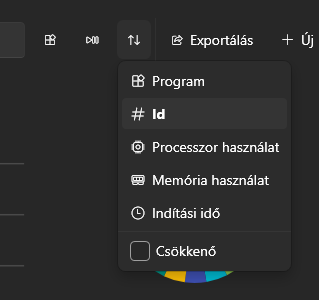

## Exportálás

Lehetőség van az aktuálisan betöltött klaszterben lévő folyamatok adatainak exportálására CSV formátumban, amely egyszerűsíti az adatok későbbi elemzését és tárolását. Ezt a `Folyamatok` fülnél a jobb felső sarokban lévő `[Exportálás]` gombbal lehet megtenni.  
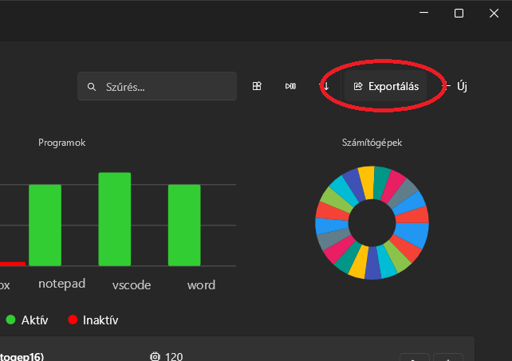  
Az exportált fájlban minden egyes sor egy-egy folyamat adatait tartalmazza, amelyek a következő információkat tartalmazzák: a folyamat neve (Name), a [számítógép](szamitogep.md), ahol fut (Computer), az állapot (Status), a processzorhasználat (ProcessorUsage) és a memóriahasználat (MemoryUsage). Az exportálás előtt meg kell adni a kívánt elérési utat, ahová a fájl el lesz mentve.  
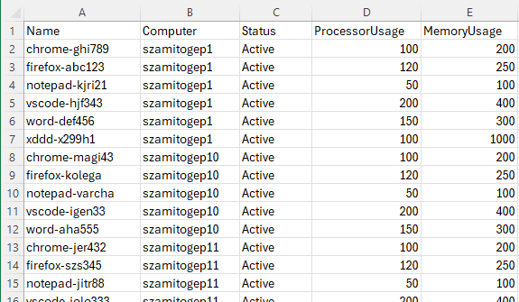

## Új futtatása

Új folyamatot indítani a `Folyamatok` fül jobb felső sarkában található `[Új]` gombbal lehet. A gomb megnyomásakor egy felugró oldal jelenik meg, ahol meg kell adni a **program típusát**, a **[számítógépet](szamitogep.md)**, ahol a folyamat futni fog, valamint annak **[állapotát](#allapot)**.  
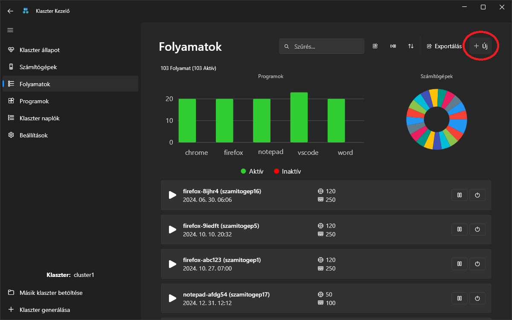  
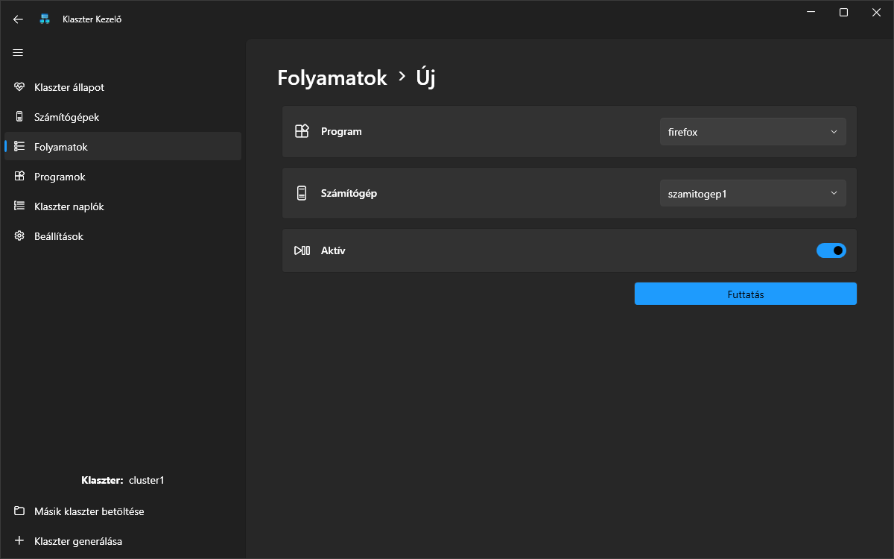  
A [programtípus](program.md) kiválasztása utáni kritikus lépés a folyamat jövőbeni állapotának megadása. Ha folyamat aktív állapotot kap, a rendszer automatikusan ellenőrzi, hogy mely [számítógépek](szamitogep.md) erőforrásai elegendőek a folyamat futtatásához, és csak ezeket engedi kiválasztani. Ha a folyamat inaktív lesz, akkor bármely számítógép kiválasztható, hiszen nem lesz hatással futtatáskor annak erőforrásaira.  
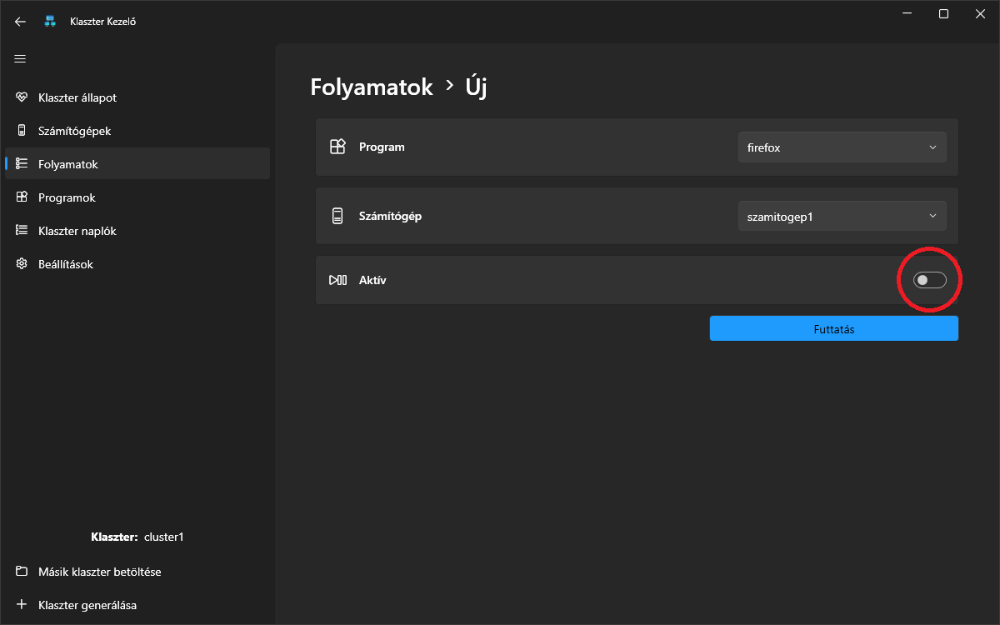  
A `[Futtatás]` gombra kattintva, ha a megadott adatok helyesek, a rendszer végrehajtja a műveletet és elindítja az új folyamatot.

## Leállítás

Egy folyamatot könnyedén leállíthatunk a folyamat szélén található `Kuka(🗑️)` ikonra kattintva.  
  
Ez a művelet automatikusan törli az adott folyamatot a rendszerből. Fontos megjegyezni, hogy a folyamat leállítása hatással van a [klaszter állapotára](klaszter.md#allapot), mivel a folyamatok leállítása erőforrás-változásokkal járhat. A leállítás sikerességét vagy annak hiányát egy _felugró üzenet_ jelzi, amely tájékoztat a művelet eredményéről, így azonnal értesülhetünk arról, hogy a folyamat sikeresen leállt-e vagy sem.  


## Egyéb információk

- Érdekesség, hogy minden egyes folyamatnál mindig pontosan jelzésre kerül, hogy mikor indult el.
- Azonban nemcsak az indítás ideje lehet figyelemre méltó, hanem a programnevek is, mivel egyesek rejtett utalásokat, vagy easter egg-eket tartalmaznak, amelyek szórakoztató felfedezéseket kínálnak.
  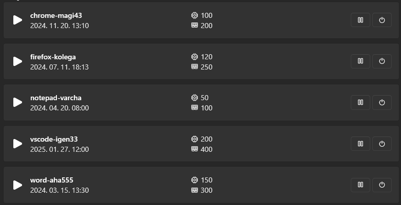
- Emellett egy számítógépen akár végtelen számú inaktív program is jelen lehet, hiszen bár ezek nem aktívan futnak, mégis ott maradhatnak a rendszerben, anélkül, hogy erőforrást használnának, ezáltal nem befolyásolják a rendszer működését.
  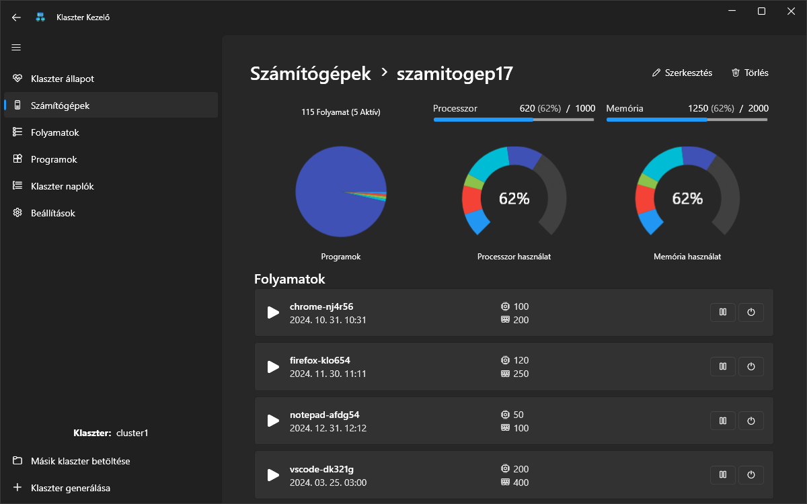
