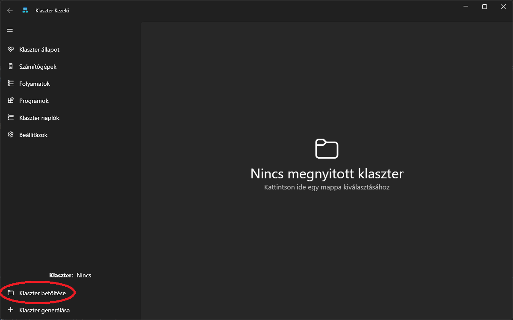
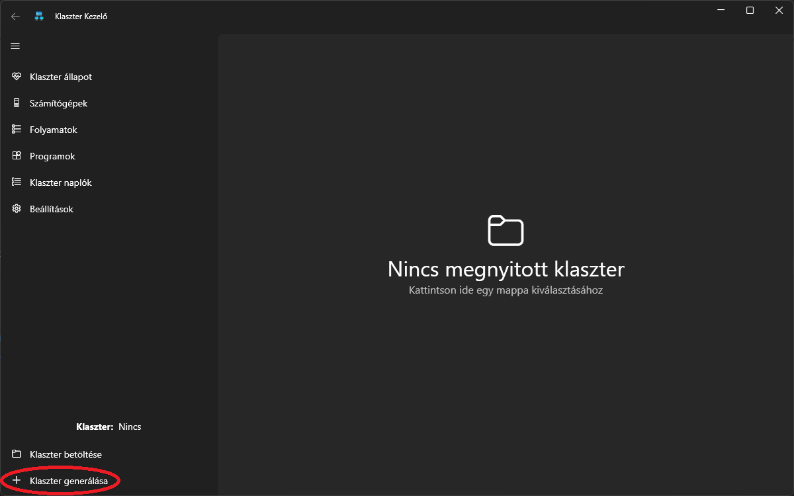
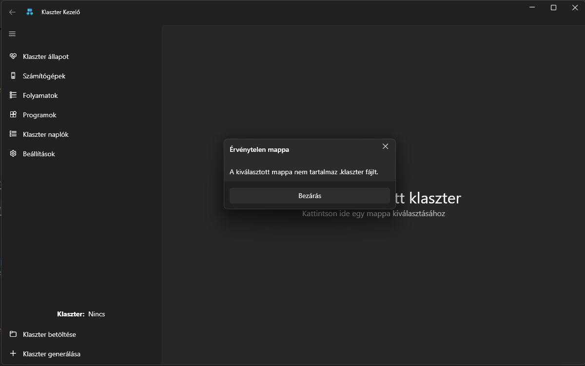
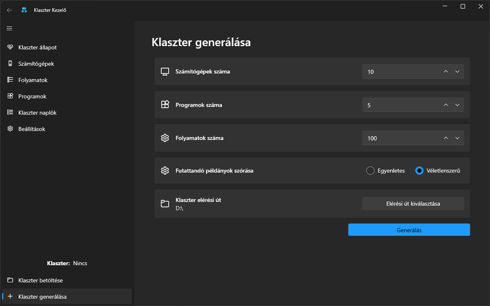
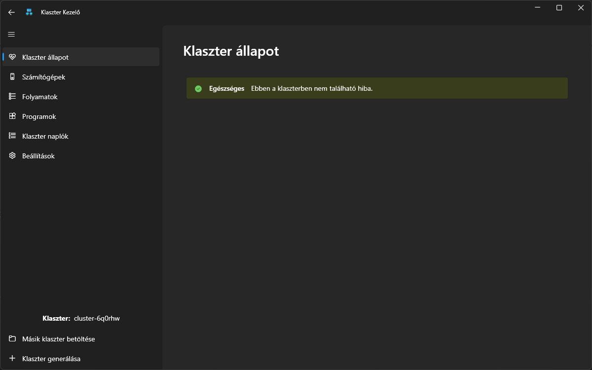
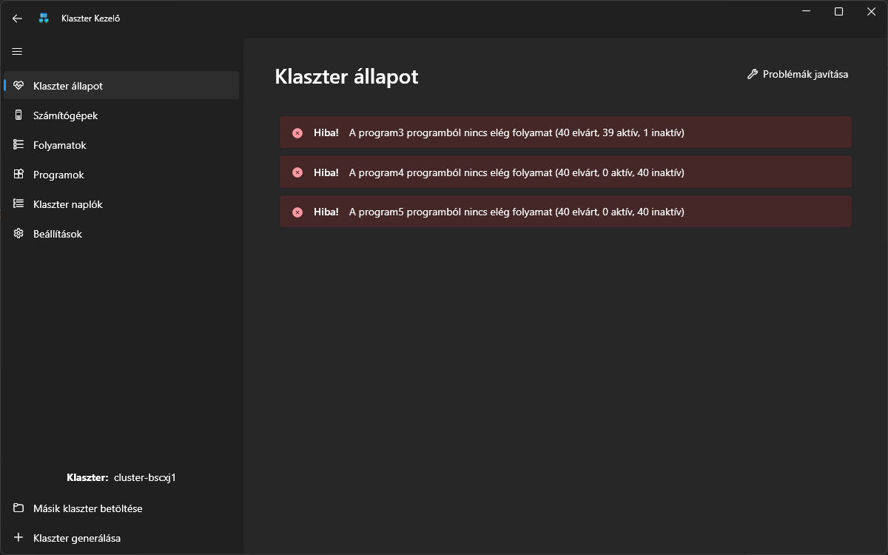
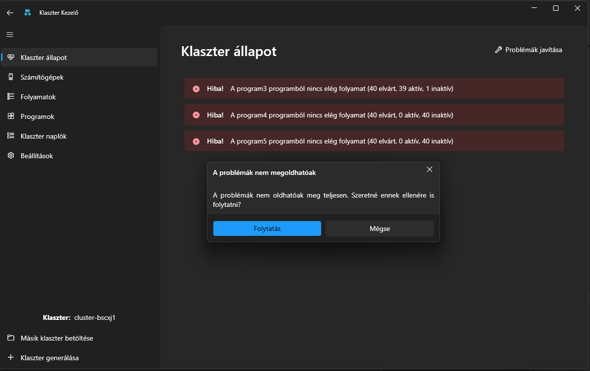
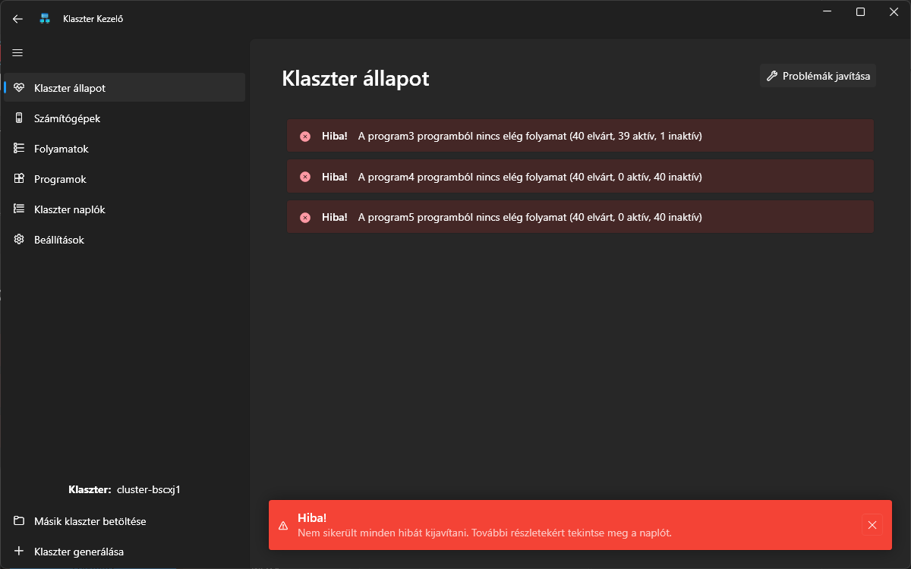
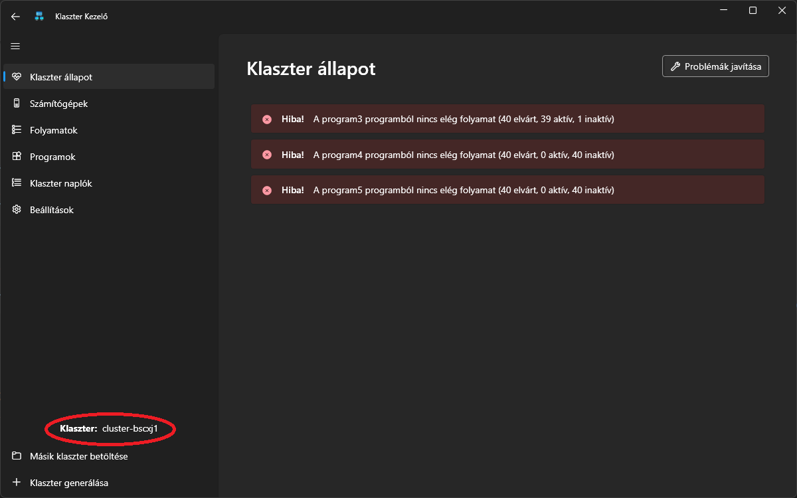

# A klaszter

A programban a számítógépek mappaként, míg a futó folyamatok fájlként lesznek ábrázolva. Például a „klaszter1” mappa az alábbi tartalommal rendelkezik:

```.
├── .klaszter
├── szamitogep2
│ ├── .szamitogep_konfig
│ ├── chrome-asdefg
│ └── word-jklbnm
└── szamitogep1
├── .szamitogep_konfig
└── chrome-qwerty
```

Ebben a klaszterben jelenleg két számítógép található: szamitogep1 és szamitogep2. Az első gépen egy chrome és egy word folyamat fut, míg a másodikon csak egy chrome. A .szamitogep_konfig fájlokat leszámítva minden fájl egy futó folyamatot jelöl, vagyis egy adott program egy példányát. Egy mappát akkor tekintünk a klaszterhez tartozó számítógépnek, ha tartalmaz egy .szamitogep_konfig fájlt.

## Tulajdonságok

A klaszteren elvárt futó folyamatokat a gyökérkönyvtárban található .klaszter fájl (adatbázisfájl) tartalmazza, az alábbi formátumban:

```
chrome
2
100
200
word
1
150
500
```

A példa fájl azt mutatja, hogy a klaszteren a „chrome” programnak 2 „AKTÍV” példányban kell futnia, egyenként 100 millimag processzorral és 200 MB memóriával, valamint a „word” programnak 1 „AKTÍV” példányban 150 millimag processzorral és 100 MB memóriával.

A fájl sorai tehát az alábbi információkat tartalmazzák minden program esetében:

- a program neve,
- a kívánt példányszám,
- az egyes példányokhoz szükséges processzor- és memóriakapacitás.

A felhasználó legfőbb célja, hogy olyan állapotot érjen el a klaszteren, amelyben minden programból a megfelelő számú példány fut valamelyik számítógépen.

## Betöltés

A program megnyitása után több lehetőségünk van:

1. Egy már jelenlegi klaszter kiválasztása
   
2. Új klaszter generálása
   

### Meglévő klaszter kiválasztzása

Klaszter kiválasztása során figyelni kell arra, hogy a kiválasztott mappában szerepeljen a .klaszter file.  
Amennyiben ennek nem teszünk eleget, arra a program figyelmeztetni fog minket:


### Új generálása

Van lehetőségünk új klaszter generálására is, ahol a következőket kell megadni:

1.  Számítógépek száma
2.  Kívánt programok száma
3.  Futtatandó folyamatok száma
4.  Folyamatok eloszlása:
    - Egyenletes: Minden programnak megközelítően ugyanannyi példányt kell futtatnia.
    - Véletlenszerű: A folyamatok száma a programok között véletlenszerűen fog szétosztódni.
5.  Klaszter generálásának helye



Ezután a program a fentiek alapján legenerálja nekünk a megfelelő klasztert és igénybe vehetjük a program többi részét.

## Állapot

A klaszter betöltődése után a klaszter jelenlegi állapotáról kapunk egy képet. Két lehetőség van:

1. A klaszter állapota megfelelő
   
2. Nem felel meg a klaszter által megkövetelt követelményeknek
   

## Helyreállítás

Amennyiben a klaszter állapota nem megfelelő, lehetőség van a hibákat a programmal helyreállíttatni, és az állapot újra megfelelő lesz.
  
Amennyiben nem lehet a hibákat helyreállítani, a program javasolja a felhasználónak a napló megtekintését, hogy megnézze mik azok a cselekvések, ami akadályozza a cluster állapotának megfelelőségét.


## Egyéb információk

- A program megnyitása során, amennyiben a program a naplózási előzményekben talál egy már megnyitott klasztert, automatikusan azt fogja megnyitni.
- A klaszter nevére kattintva a program megnyitja a fájlkezelőt a klaszter mappájának helyén, amennyiben nincs klaszter megnyitva, akkor csak simán a fájlkezelő nyílik meg.
  
