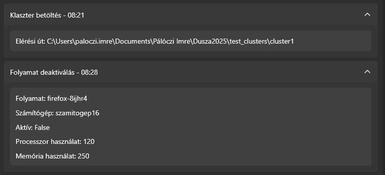
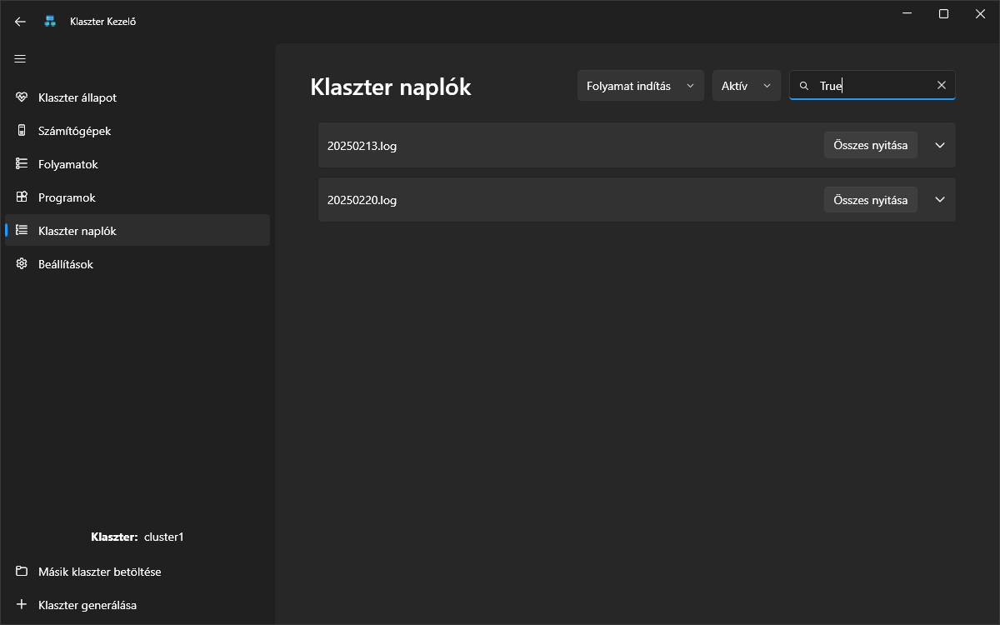

# Naplózás

A rendszer naplózási funkciója minden fontos eseményt rögzít annak érdekében, hogy a felhasználók és rendszergazdák visszakövethetően monitorozhassák a [klaszter](klaszter.md) működését. A naplófájl tartalmazza az egyes **események típusát**, azok **pontos időpontját**, valamint az esetlegesen kapcsolódó **további információkat**.


Ezeket az adatokat egy `Logs` nevű mappába, egy `.log` kiterjesztésű fájlba menti. A fájlnév mindig az aktuális dátumból jön létre a következő módon: `yyyyMMdd`. Ha már létezik egy naplófájl az aktuális dátummal, akkor az új sor az adott fájlhoz hozzáfűződik, különben új fájlt hoz létre, aminek az első sora az új adat.


## Működése

Minden egyes esemény után automatikusan lefut egy naplózási folyamat a [fentebb](#naplozas) említett módon. Ezeket az adatokat a fájlokból kiolvasva a `Klaszter naplók` fülnél érhetjük el, és tanulmányozhatjuk egy letisztultabb, praktikusabb környezetben.

Itt lehetőségünk van az egyes fájlok tartalmát részleteiben listázni, napokra leosztva. Ha a kártyára kattintunk, lenyílik az adott fájl tartalma, ami egy kártya lista az eseményekről. A kártyák önmagukban csak az események típusát és végrehajtásuk időpontját tartalmazzák, kibontásuk után (ha van rá lehetőség) viszont az esemény további részletei jelennek meg. Ezek eseménytípusonként változnak.


A rendszer a következő eseményeket naplózza:

- **OpenApplication:** *Az alkalmazás megnyitása*
- **CloseApplication:** *Az alkalmazás bezárása*
- **LoadCluster:** *A [klaszter](klaszter.md) betöltése*
- **AddComputer:** *Új [számítógép](szamitogep.md) hozzáadása*
- **DeleteComputer:** *[Számítógép](szamitogep.md) törlése*
- **ExportCSV:** *Naplófájl exportálása CSV formátumban*
- **AddProgram:** *Új [program](program.md) hozzáadása a [klaszterhez](klaszter.md)*
- **RunProgramInstance:** *Egy [program példányának](folyamat.md) elindítása*
- **ShutdownProgramInstance:** *Egy [program példányának](folyamat.md) leállítása*
- **ModifyProgram:** *Egy [program](program.md) beállításainak módosítása*
- **ShutdownProgram:** *Egy teljes [program](program.md) leállítása*
- **ClearProgramInstances:** *Egy [számítógép](szamitogep.md) tehermentesítése*
- **MoveProgramInstance:** *Egy [programpéldány](folyamat.md) áthelyezése másik [számítógépre](szamitogep.md)*
- **OptimizeProgramInstances:** *[Programpéldányok](folyamat.md) optimalizálása*
- **ModifyComputer:** *Egy [számítógép](szamitogep.md) beállításainak módosítása*
- **SpreadProgramInstances:** *[Folyamatok](folyamat.md) egyeneletesen történő elosztásának a [klaszterben](klaszter.md)*
- **FixIssues:** *Klaszterhibák automatikus javítása*
- **ActivateProgramInstance:** *Egy inaktív [folyamat](folyamat.md) aktiválása*
- **DeactivateProgramInstance:** *Egy aktív [folyamat](folyamat.md) inaktiválása*
- **GenerateCluster:** *Új [klaszter](klaszter.md) generálása*

Minden naplózott esemény a következő formátum szerint kerül rögzítésre:

```
<Esemény típusa> - <Időbélyeg> - <Részletek>
```

Pl.:

```
RunProgramInstance - 2025.02.21. 09:11:54 - word-6r82gx - 2025.02.21. 09:11:54 - False - 150 - 300 - szamitogep17
```

## Szűrés

Szűrésre is van lehetőségünk, amit a jobb felső sarokban érhetünk el. Itt két legördülő lista és egy szövegmező található.

Általuk a naplózott események szűrhetőek eseménytípus, részletek és keresett érték alapján:

- **Eseménytípus szerinti szűrés** – Az első legördülő lista segítségével kiválasztható az esemény típusa (pl. "Program indítása" vagy "Számítógép hozzáadása").
- **Részletek szerinti szűrés** – A második legördülő lista az eseménytípus alapján megjelenő részletes szűrési lehetőségeket tartalmazza (pl. adott program vagy számítógép neve).
- **Szöveges keresés** – A keresőmezőbe beírható egy konkrét érték, amelyet a fent kiválasztott szempontok szerint keres a rendszer.

Ez a szűrési rendszer lehetővé teszi a felhasználó számára, hogy gyorsan és hatékonyan megtalálja a releváns naplózott eseményeket.
A következő példában olyan naplóadatokat keresünk, amelyek egy olyan folyamatindítást dokumentálnak, amelyek állapota [aktív](folyamat.md#allapot).


## Egyéb információk

- A naplófájl automatikusan generálódik a rendszer indulásakor, és folyamatosan frissül az eseményekkel.
- Akár több, mint **10.000 soros** naplófájlt is tud kezelni az oldal, viszont ez a rendszer lassulásához vezethet. Ezt az értéket az optimalizáskor hamar elérhetjük.
- **Érdekesség:** Vannak olyan naplóadatok, amelyek nem tartalmaznak egyéb információkat, így azoknál nem lehet specifikus információkra szűrni (pl. Alkalmazás megnyitás)