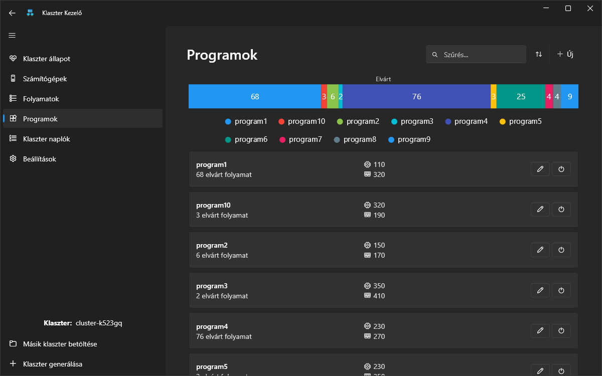
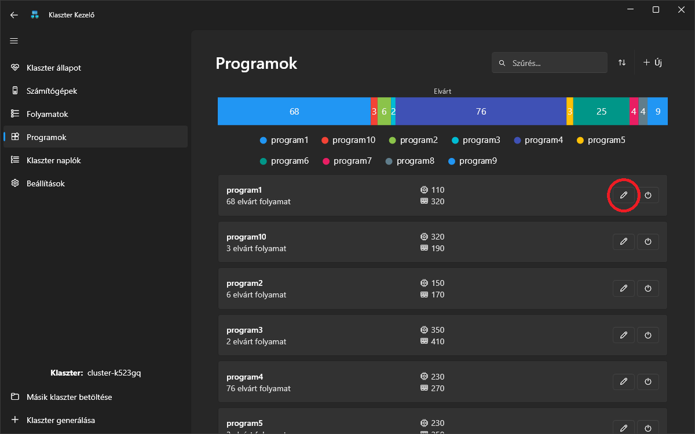
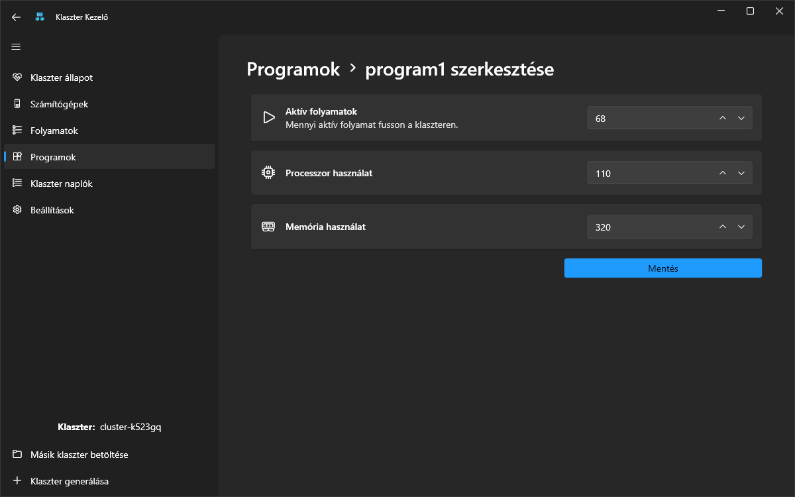

# Program

A klaszteren futtatható programok a `.klaszter` fájlban vannak definiálva. Ez a fájl tartalmazza a programokhoz tartozó beállításokat és erőforrásigényeket, amelyek biztosítják a klaszter megfelelő működését. Minden egyes programnak meg kell felelnie bizonyos elvárásoknak, hogy a rendszer stabil maradjon és hatékonyan működjön.

## Elvárt futási igények

Egy klaszteren futtatott programnak rendelkeznie kell bizonyos alapvető információkkal annak érdekében, hogy a rendszer megfelelően tudja kezelni az erőforrásokat és fenntartsa az egyensúlyt. Az alábbi adatok megadása szükséges minden program esetében:

1. **Program neve:** A program nevét egyedileg kell meghatározni, hogy a rendszer pontosan azonosítani tudja azt. Nem lehet két azonos nevű program egy klaszteren belül.
2. **Futtandó példányok száma:** Ez határozza meg, hogy a program hány példányban kell fusson a klaszteren. Ha nem a meghatározott számú példány fut (legyen az aktív vagy inaktív), akkor a klaszter állapota sérül, ami negatívan befolyásolhatja a rendszer működését.
3. **Processzorigény:** Minden programnak szüksége van egy bizonyos számú processzorra vagy processzormagra, amelyet a futtatása során használ. Ezt az erőforrásigényt előre meg kell határozni, hogy a rendszer megfelelően ossza el a rendelkezésre álló kapacitást.
4. **Memóriaigény:** A programnak rendelkeznie kell egy előre meghatározott memóriafoglalással is, amely biztosítja, hogy a program futtatása közben ne lépjen fel erőforráshiány.

## Részletek

A Programok oldal megnyitásakor egy áttekinthető lista és egy szemléletes grafikon jelenik meg. A lista a programok legfontosabb adatait tartalmazza, beleértve a nevüket, a processzor- és memóriaigényüket, valamint az elvárt aktív folyamatok számát. A grafikon vizuálisan ábrázolja az aktív folyamatok eloszlását, lehetővé téve az erőforrások hatékony nyomon követését és összehasonlítását.

## Létrehozás

Új program létrehozására az _"Új"_ gombra kattintva van lehetőség.

Ezen a felületen be kell állítani a programhoz tartozó fontos paramétereket, amelyek biztosítják a megfelelő működését. Az alábbi információkat kell megadni:

1. **Program neve:** Az új program számára egy egyedi nevet kell megadni, amely megkülönbözteti az összes többi programtól.
2. **Aktív folyamatok száma:** Meghatározhatjuk, hogy a programnak hány példányban kell fusson a klaszteren.
3. **Processzorigény:** Meg kell adni, hogy mennyi CPU-t vagy processzormagot igényel a program.
4. **Memóriaigény:** A program számára lefoglalandó memóriát is meg kell határozni.

## Módosítás

A már meglévő programokat szükség esetén módosítani is lehet.

A módosítási lehetőségek lehetővé teszik a következő paraméterek szerkesztését:

1. **Aktív folyamatok száma:** Amennyiben szükséges, módosíthatjuk a program példányszámát, amely azt befolyásolja, hogy hány példányban fusson a klaszteren.
2. **Processzorigény:** Ha a program futtatása során kiderül, hogy több vagy kevesebb processzorra van szükség, ezt az értéket módosíthatjuk a hatékonyabb erőforráskezelés érdekében.
3. **Memóriaigény:** A program memóriabeállítását is módosíthatjuk, ha szükség van további erőforrásokra vagy optimalizálásra.

A módosítások elvégzése után a klaszter a beállított új paraméterek szerint kezeli a programot.

## Törlés

Amennyiben egy programra már nincs szükség, lehetőség van annak leállítására.

A törlés során a rendszer először megkérdezi, hogy valóban szeretnénk-e leállítani a programot. Ez egy biztonsági lépés, hogy véletlen leállítás ne történhessen.

Ha megerősítjük a leállítási szándékunkat, akkor a klaszter az alábbi lépéseket hajtja végre:

1. Először minden a programhoz kapcsolódó folyamatot leáll.
2. A leállított folyamatok után maga a program is eltávolításra kerül a rendszerből.

Fontos megjegyezni, hogy ha egy programot törlünk, az nem vonható vissza, így érdemes meggyőződni arról, hogy valóban szükséges-e az adott program eltávolítása.

## Rendezés és szűrés

A klaszteren futó programok listáját könnyen átláthatóvá tehetjük különböző rendezési és szűrési opciók segítségével. A következő szempontok alapján lehet keresni és rendezni a programokat:

1. **Név szerint:** A programokat ábécé sorrendbe lehet rendezni, így könnyebben megtalálhatóak a kívánt alkalmazások.
2. **Erőforrásigény szerint:** Lehetőség van a programok szűrésére és rendezésére a processzorigény vagy memóriahasználat alapján, hogy könnyebben azonosíthassuk a nagy erőforrást igénylő alkalmazásokat.
3. **Futtatott példányszám szerint:** A programokat az alapján is rendezhetjük, hogy hány példányban futnak a klaszteren.
4. **Státusz alapján:** Lehetőség van csak az aktív vagy az inaktív programok megjelenítésére, így könnyebben kezelhetők a futó és a leállított alkalmazások.

## Egyéb információk

Egy program akkor is leállítható, ha egyetlen darab példány sem fut belőle. Ilyenkor a program csak szimplán eltávolítódik a rendszerből.
