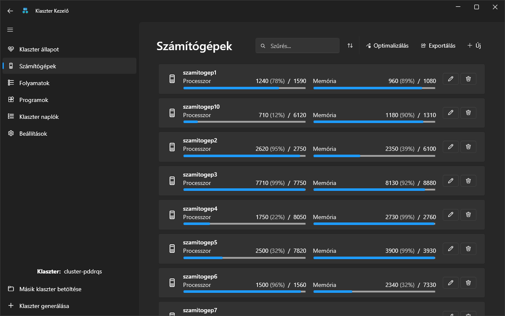
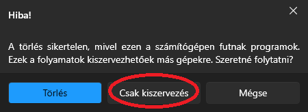

# Számítógép

A számítógépek egy-egy mappával vannak szimbolizálva, míg a számítógép erőforrásait a mappán belül található .szamitogep_konfig fájl írja le. Ezek az erőforrások jelen esetben a számítógép memória- és processzorkapacitását jelentik. A számítógépek képesek a rendelkezésre álló programok közül valamennyi példányt futtatni az erőforrás megfelelő kapacitásáig.

## Erőforrások

Például egy .szamitogep_konfig fájl tartalma a következő lehet:

```
2800
12000
```

Az első sor a processzor kapacitását jelöli egy egész szám formájában, amely a processzormagok darabszámának ezred részét, azaz millimagot ad meg. Például a 2800 érték azt jelenti, hogy a szamitogep2 számítógépen 2,8 processzormag áll rendelkezésre.

A második sor szintén egy egész szám, amely az elérhető memóriakapacitást mutatja MB-ban. Például a 12000 érték azt jelzi, hogy a szamitogep2 számítógép 12 GB memóriát használhat.

## Részletek

A számítógéplistát megnyitva gyors áttekintést kaphatunk a jelenlegi számítógépekről és azok leterheltségéről.

<br>

## Tehermentesítés és törlés

Számítógép törlése esetén két opció léphet fel. Az egyik, hogy a kitörlendő számítógépen még vannak futó programok, a másik meg, hogy már nincsen terhelés alatt.

1. Amennyiben egy számítógépen már nincsen futó program, a számítógép minden akármi plusz lépés nélkül törölhető.
   <br>

2. Ha egy számítógépet futó programokkal akarunk eltávolítani, akkor előtte **tehermentesítenünk** kell, erre két lehetőségünk van:
    - a számítógépet tehermentesítjük és utána abban a pillanatban töröljük
      
    - a számítógépet csak tehermentesítjük (ebben az esetben az történik, hogy a számítógép nem kerül eltávolításra, hanem minden folyamat alól felszabadul)
      

**Tehermentesítés**: Az a lépés, amikor egy számítógépről minden folyamatot átcsoportosítunk egy másik gépre.

**Kivétel**: Szélsőséges esetben történhet olyan, hogy a többi rendelkezsére álló számítógépek magas kihasználtsága miatt nincs lehetőség teljes tehermentesítésre. Erre a program figyelmeztet minket, és csak annyi folyamatot fog áthelyezni a többi számítógépre, amennyit csak tud, a többit meg rajta hagyja a jelenlegi gépen. Ebben az esetben akár a törlés gombra, akár a kiszervezés gombra kattintva, csak annyi program fog kiszerveződni, amennyi csak tud, a többi pedig a gépen marad.


## Rendezés és szűrés

A számítógépek között lehetőség van szűrésre és rendezésre az alábbi szempontok szerint:


## Exportálás

Lehetőségünk van a számítógépek CSV exportálására is a következő adatokkal:

    - Számítógép neve
    - Processzor kapacitása
    - Processzor jelenlegi terheltsége
    - Memória kapacitása
    - Memória jelenlegi terheltsége


## Új hozzáadása

Lehetőség van számítógép új hozzáadására is, ahol az alábbi adatokat kell megadnunk:

1. Számítógép neve (egyedi kell legyen)
2. Processzor kapacitása
3. Memória kapacitása


## Optimalizáció

Lehetőség van a gépeken futó folyamatok eloszlásának optimalizálására is.


Ehhez meg kell adnunk azt a minimum és maximum százalékot, amik között a számítógép terhelésének lennie kell.


Amennyiben lehetséges ez az elosztás, akkor a gépek terheltsége a megadott intervallumon belül lesz.


Ez amennyiben nem lehetséges a program felajánlja azt a lehetőséget, hogy minden gép egyenlő mértékben legyen leterhelt.


## Részletek

A számítógépek részletesebb információinak megtekintéséhez rá kell kattintani a megfelelő kártyára. Ezután látható a számítógépen futó folyamatok száma (aktív és inaktív), a számítógép leterheltsége, valamint különféle grafikonok. A grafikonok azt mutatják meg, hogy milyen eloszlásban mennyi program fut, valamint hogy az egyes programok milyen eloszlásban terhelik processzor és memória szintjén egyaránt a számítógépeket.


Továbbiakban lehetőség van itt is a számítógép törlésére, amire ugyan az érvényes, mint a [fent](#tehermentesites-es-torles) leírtakban.


Lehet még a számítógépeket szerkeszteni is, ahol a processzor és a memória kapacitását lehet állítani. Fontos megjegyeznivaló, hogy mind a processzor és mind a memóriakapacitásnak nagyobbnak kell lennie, mint az akutális leterheltség, ha ennek nem teszünk eleget, a program nem fogja engedélyezni a szerkesztést.


Végső soron lehet még a már számítógépen futó folyamatokat leállítani, vagy pedig aktívvá/inaktívvá tenni.


## Egyéb információk

- Mind a listában, és mind a részletek oldalon megtekinthető a gép aktuális terheltsége százalékos értékben is.
- Ha sok folyamatot futtatunk egy számítógépen (nem túlterhelve annak erőforrásait), akkor lassulás észlelhető. Ezt le is teszteltük több, mint 10.000 folyamattal. Ezek betöltése együttesen kb. 14 GB memóriát igényelt.

