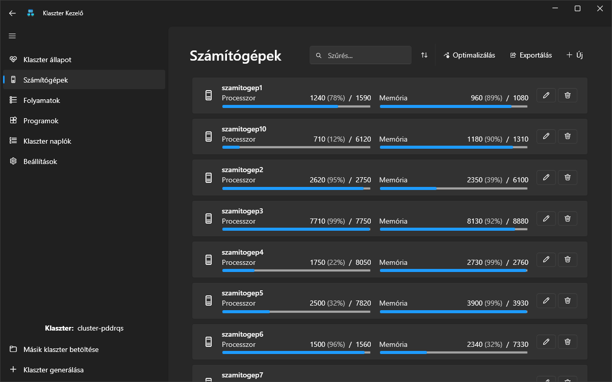
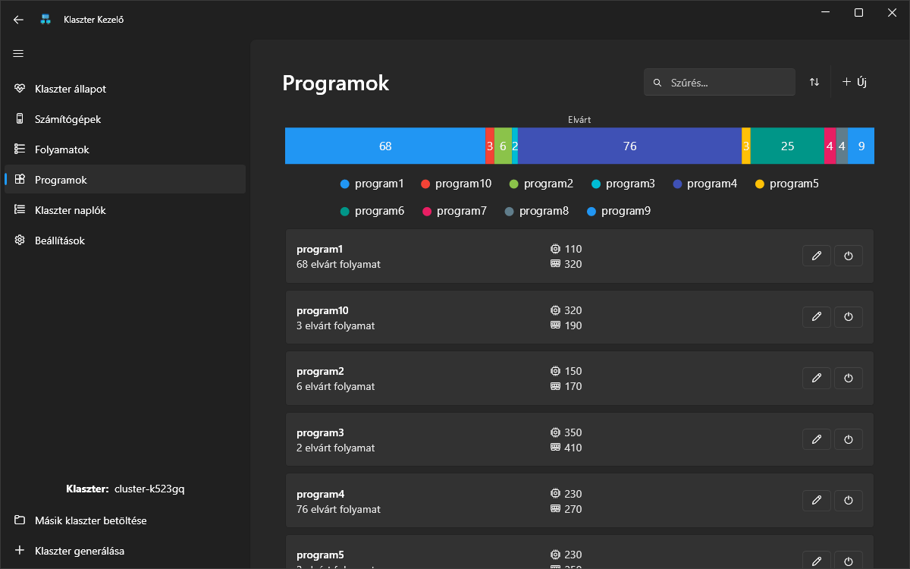

---
hide:
  - toc
---

# Kezdőlap

   
   
   

## Bevezetés

Ezen a weboldalon a **Kibirod, kolega** csapat programjának dokumentációja található.

A dokumentáció 3 részre tagolható:

1. [Bevezetés](bevezetes/programrol.md): Tartalmazza a program rövid bemutatását, a feladat ismertetését,
   és a csapattagok bemutatkozását.
2. [Felhasználói dokumentáció](felhasznaloi/mukodes.md): Tartalmazza a program használatához szükséges összes információt.
   Részletesen ismerteti a program működését és funkcióit, és leírja a lehetséges felhasználói eseteket.
3. [Fejlesztői dokumentáció](fejlesztoi/fejlesztes.md): Ismerteti a program fejlesztésének a menetét, a szerkezeti felépítését,
   valamint egyes funkciót technikai működését.
